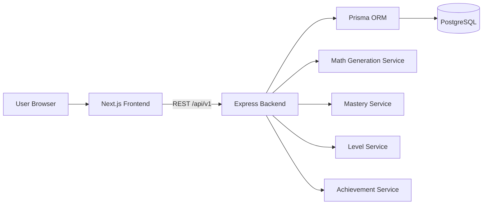
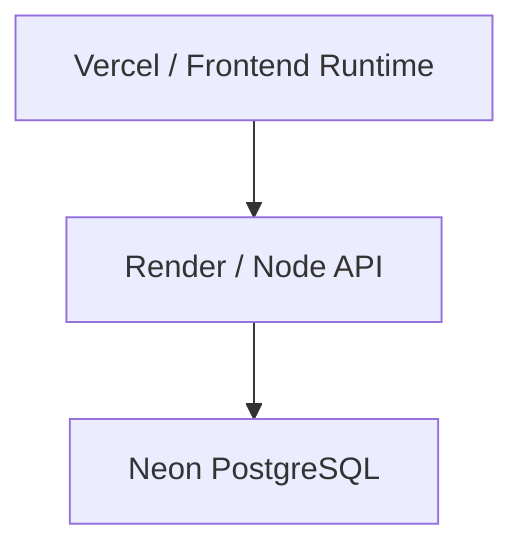
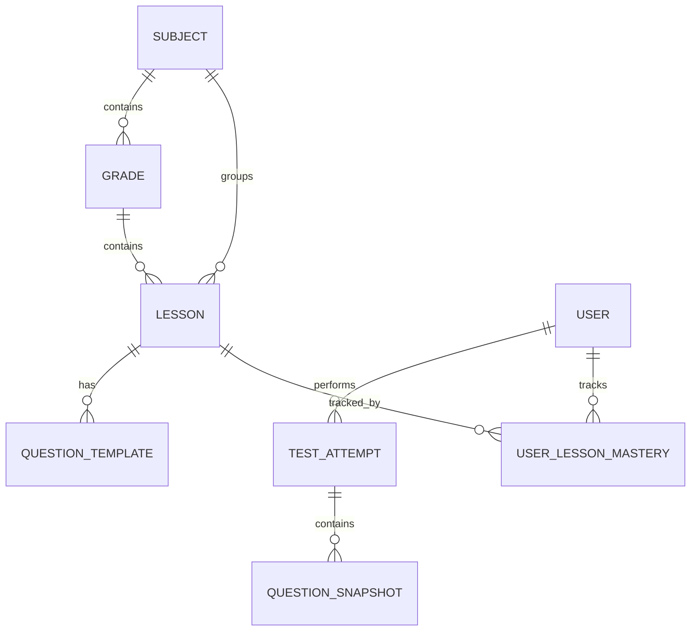
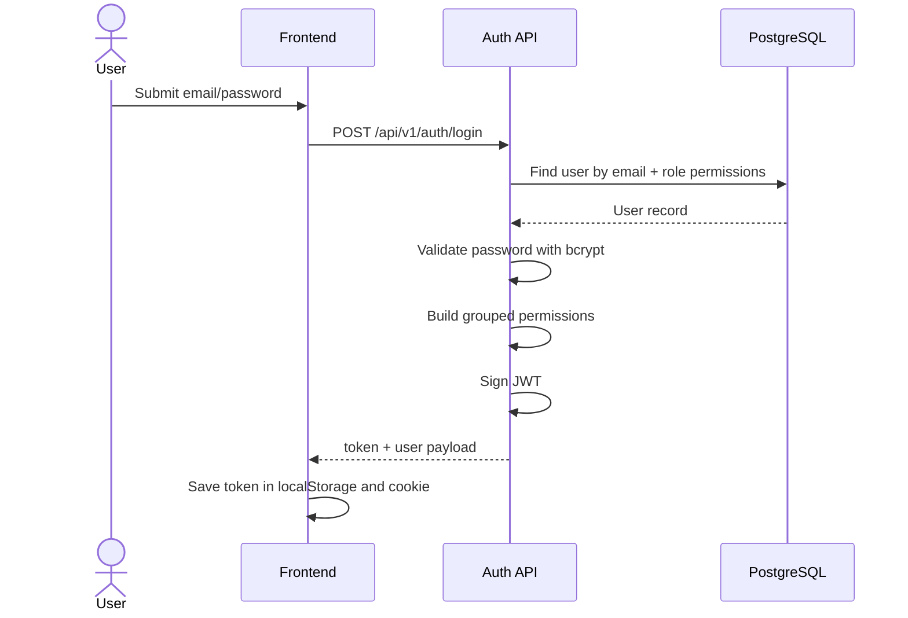
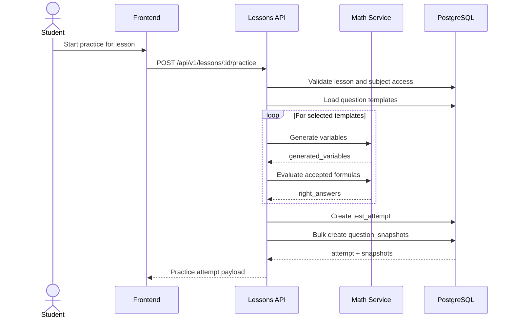
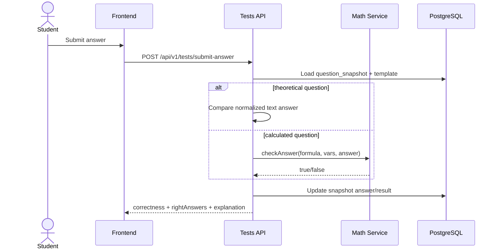
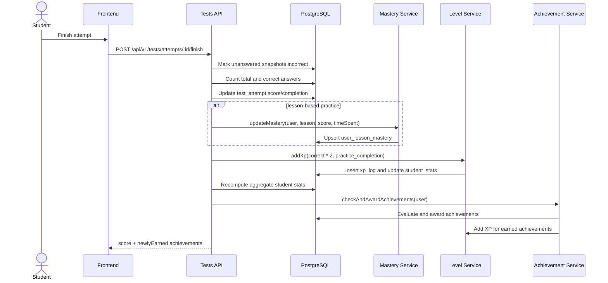
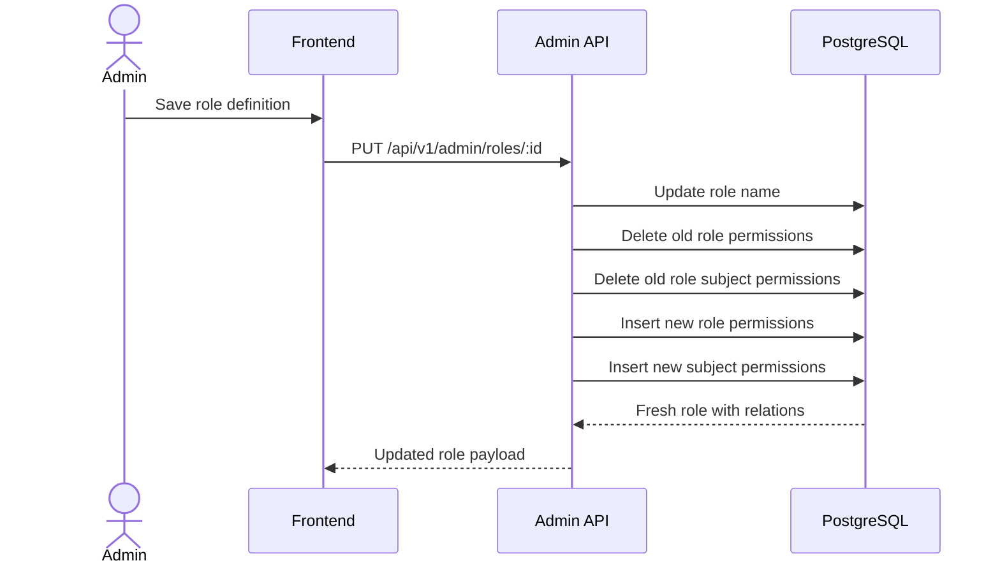

# Anhoc Technical Design

## 1. Purpose

This document describes the current technical design of the Anhoc project based on the implemented code in `frontend/` and `backend/`.

It covers:

- Architecture design
- Functional design
- Data model overview
- REST API specification
- Main sequence flows

## 2. System Overview

Anhoc is a math learning platform with:

- Student learning content by subject and grade
- Practice sessions generated from question templates
- Grade-level test sessions
- Progress tracking through mastery, XP, levels, and achievements
- Admin functions for lessons, question templates, users, roles, and access control

## 3. Architecture Design

### 3.1 Logical Architecture



### 3.2 Deployment View



### 3.3 Backend Structure

- `backend/server.ts`
  - Bootstraps Express
  - Configures CORS and JSON middleware
  - Mounts versioned APIs under `/api/v1`
  - Seeds achievements on startup
- `backend/routes/`
  - `auth.ts`: login, register, profile, password, activity
  - `lessons.ts`: lessons, grades, subjects, practice start, study tracking
  - `tests.ts`: attempts, answer submission, template management, grade tests, question reports
  - `admin.ts`: users, roles, access control, dashboard statistics
  - `achievements.ts`: achievement catalog and award checks
- `backend/middleware/auth.ts`
  - JWT authentication
  - Permission-based authorization
  - self-or-admin access checks
- `backend/services/`
  - `mathService.ts`: variable generation, answer evaluation, template rendering
  - `masteryService.ts`: lesson mastery and study-time updates
  - `levelService.ts`: XP accumulation and level calculation
  - `achievementService.ts`: seed and award achievements

### 3.4 Frontend Structure

- `frontend/src/app/`
  - App Router pages for auth, student, and admin areas
- `frontend/src/services/`
  - Axios-based API clients
- `frontend/src/redux/`
  - Auth and permission state
- `frontend/src/components/`
  - Student and admin UI components

### 3.5 Security Model

- Authentication uses JWT in `Authorization: Bearer <token>`
- Frontend stores token in:
  - `localStorage`
  - browser cookie for route middleware/proxy handling
- Authorization is based on:
  - role name in JWT
  - grouped permissions per resource
  - subject-level restrictions via `role_subject_permissions`

### 3.6 Core Architectural Decisions

- REST API rather than server actions or GraphQL
- Prisma as the data access layer
- Question instances are materialized as `question_snapshots`
- Practice/test completion triggers secondary progression services:
  - mastery update
  - XP grant
  - student stats update
  - achievement evaluation

## 4. Functional Design

### 4.1 Authentication and Identity

Capabilities:

- Register a new user
- Login and receive JWT
- Read current profile
- Change password
- View 7-day XP activity

Business behavior:

- Registration creates both `users` and `student_stats`
- Login expands role permissions into a grouped structure such as:
  - `lesson -> [read, manage]`
  - `user -> [manage]`

### 4.2 Learning Content Management

Capabilities:

- Manage subjects
- Manage grades
- Create, update, delete lessons
- List lessons with grade and subject metadata

Business behavior:

- Lessons belong to one grade and one subject
- Non-admin access can be restricted to specific subjects
- Lesson content is bilingual:
  - `title_en`, `title_vi`
  - `content_markdown_en`, `content_markdown_vi`

### 4.3 Practice Engine

Capabilities:

- List lessons with available practice
- Start lesson-based practice
- Answer generated questions
- Finish attempt and compute score
- View attempt detail and practice history

Business behavior:

- Practice sessions are stored as `test_attempts` with `is_practice = true`
- Each session creates multiple `question_snapshots`
- Snapshot data stores:
  - template reference
  - generated variables
  - accepted right answers
  - student answer
  - correctness and points
- At finish:
  - unanswered snapshots are marked incorrect
  - score is calculated as `(correct / total) * 100`
  - lesson mastery is updated for lesson-based practice
  - XP is awarded as `correct_answers * 2`
  - achievements are re-evaluated

### 4.4 Grade Test Engine

Capabilities:

- Discover grade tests derived from available lesson templates
- Start a 50-question grade test
- Submit answers
- Finish and score the test

Business behavior:

- Grade tests are assembled dynamically from all templates under lessons in the selected grade
- Grade test attempts use:
  - `is_practice = false`
  - `lesson_id = null`
- The API returns attempts with fully expanded snapshot and lesson metadata

### 4.5 Question Template Management

Capabilities:

- Create one or many templates
- Read, update, delete templates
- Report problematic generated questions
- Review and resolve reports

Business behavior:

- Templates support bilingual prompt/explanation content
- Difficulty is normalized to `easy | medium | hard`
- Theoretical questions must have:
  - exactly 1 correct answer
  - exactly 3 false answers in `logic_config.false_answers`
- Dynamic math questions support:
  - variable ranges
  - choices
  - derived expressions
  - constraints
  - multiple accepted formulas

### 4.6 Progression and Gamification

Capabilities:

- Track lesson study time
- Track lesson mastery
- Award XP and levels
- Award achievements
- Show achievement catalog and earned state

Business behavior:

- Mastery status becomes:
  - `not_started`
  - `in_progress`
  - `completed` when score >= 80
- XP is stored in `xp_logs`
- Level is recalculated from cumulative XP
- Achievements are seeded on startup and checked after completion flows

### 4.7 Administration

Capabilities:

- List users and roles
- Create, update, delete users
- Assign role to a user
- Manage role permissions and subject permissions
- View user performance insights
- View dashboard statistics

Business behavior:

- Access control is split into:
  - action/resource permissions
  - subject-level access
- Admin dashboard aggregates:
  - users
  - lessons
  - attempts
  - average score
  - top users
  - recent activity
  - 14-day history

## 5. Data Model Overview

### 5.1 Main Entities

| Entity | Purpose |
|---|---|
| `users` | Application users |
| `roles` | Named roles such as admin/student |
| `actions`, `resources`, `role_permissions` | Dynamic RBAC |
| `subjects`, `grades`, `lessons` | Learning content hierarchy |
| `question_templates` | Reusable question definitions |
| `test_attempts` | Practice or test session header |
| `question_snapshots` | Materialized generated questions per attempt |
| `user_lesson_mastery` | User progress per lesson |
| `student_stats` | Aggregated XP, level, score, activity |
| `achievements`, `user_achievements` | Gamification rewards |
| `xp_logs` | XP history |
| `question_template_reports` | Problem report workflow |
| `audit_logs`, `activity_evidence` | Traceability and user evidence |

### 5.2 Content Hierarchy



### 5.3 Important Persistence Rules

- A generated practice/test question is not computed on every render; it is persisted as a snapshot
- Lesson-based practice attempts retain `lesson_id`
- Grade tests intentionally do not bind the attempt to one lesson
- Student progress is a combination of:
  - raw attempts
  - derived mastery
  - cumulative XP/level
  - achievements

## 6. API Specification

Base URL:

```text
/api/v1
```

Authentication:

- Protected endpoints require `Authorization: Bearer <token>`

Response conventions:

- Success returns JSON payloads
- Validation/authorization errors generally return `400`, `401`, `403`, `404`, or `409`
- Unhandled failures return `500`

### 6.1 Health

| Method | Path | Auth | Description |
|---|---|---|---|
| `GET` | `/health` | No | API health check |

### 6.2 Auth API

| Method | Path | Auth | Description |
|---|---|---|---|
| `POST` | `/auth/register` | No | Register user |
| `POST` | `/auth/login` | No | Login and return token |
| `GET` | `/auth/permissions/:userId` | No | Get grouped permissions by user |
| `GET` | `/auth/profile` | Yes | Get current user profile |
| `PATCH` | `/auth/password` | Yes | Change current user password |
| `GET` | `/auth/activity` | Yes | Get 7-day XP activity |

Example login request:

```json
{
  "email": "student@example.com",
  "password": "secret123"
}
```

Example login response:

```json
{
  "token": "jwt-token",
  "user": {
    "id": "uuid",
    "username": "student1",
    "role": "student",
    "permissions": {
      "lesson": ["read"],
      "test": ["read"]
    }
  }
}
```

### 6.3 Lessons API

| Method | Path | Auth | Description |
|---|---|---|---|
| `POST` | `/lessons` | Yes | Create lesson |
| `GET` | `/lessons` | Yes | List lessons |
| `GET` | `/lessons/grades` | Yes | List grades |
| `POST` | `/lessons/grades` | Yes | Create grade |
| `GET` | `/lessons/subjects` | Yes | List subjects |
| `POST` | `/lessons/subjects` | Yes | Create subject |
| `GET` | `/lessons/practice-available` | Yes | List lessons with templates |
| `POST` | `/lessons/:id/practice` | Yes | Start lesson practice |
| `GET` | `/lessons/:id` | Yes | Get lesson detail |
| `PUT` | `/lessons/:id` | Yes | Update lesson |
| `GET` | `/lessons/mastery/all` | Yes | Get current user mastery |
| `POST` | `/lessons/:id/study-time` | Yes | Track study time |
| `DELETE` | `/lessons/:id` | Yes | Delete lesson |

Practice start request:

```json
{
  "difficulty": "easy"
}
```

Practice start response shape:

```json
{
  "id": "attempt-uuid",
  "user_id": "user-uuid",
  "lesson_id": "lesson-uuid",
  "is_practice": true,
  "snapshots": [
    {
      "id": "snapshot-uuid",
      "generated_variables": {
        "a": 5,
        "b": 9
      },
      "right_answers": ["14"],
      "template": {
        "id": "template-uuid",
        "template_type": "arithmetic",
        "body_template_vi": "..."
      }
    }
  ]
}
```

### 6.4 Tests API

| Method | Path | Auth | Description |
|---|---|---|---|
| `GET` | `/tests/grade-tests` | Yes | List grade tests |
| `POST` | `/tests/grade-tests/:gradeId/start` | Yes | Start grade test |
| `GET` | `/tests/attempts/:id` | Yes | Get attempt detail |
| `POST` | `/tests/submit-answer` | Yes | Submit answer for snapshot |
| `POST` | `/tests/attempts/:id/finish` | Yes | Finish attempt |
| `POST` | `/tests/templates` | Yes | Create one or many templates |
| `GET` | `/tests/templates` | Yes | List templates |
| `GET` | `/tests/templates/:id` | Yes | Get template detail |
| `PUT` | `/tests/templates/:id` | Yes | Update template |
| `DELETE` | `/tests/templates/:id` | Yes | Delete template |
| `POST` | `/tests/question-reports` | Yes | Report a question |
| `GET` | `/tests/question-reports` | Yes | List reports |
| `PATCH` | `/tests/question-reports/:id` | Yes | Update report status |
| `GET` | `/tests/my-practice-history` | Yes | List practice history |

Submit answer request:

```json
{
  "snapshotId": "snapshot-uuid",
  "studentAnswer": "42"
}
```

Submit answer response:

```json
{
  "isCorrect": true,
  "rightAnswers": ["42"],
  "explanation": "..."
}
```

Finish attempt response:

```json
{
  "user_id": "user-uuid",
  "lesson_id": "lesson-uuid",
  "started_at": "2026-05-27T06:00:00.000Z",
  "total_score": 90,
  "newlyEarned": [
    {
      "slug": "first-step",
      "title_en": "First Step",
      "title_vi": "Buoc Dau Tien",
      "icon": "Footprints",
      "xp_reward": 50
    }
  ]
}
```

Question template payload:

```json
{
  "lesson_id": "lesson-uuid",
  "template_type": "arithmetic",
  "difficulty": "medium",
  "body_template_en": "What is $a$ + $b$?",
  "body_template_vi": "$a$ + $b$ bang bao nhieu?",
  "explanation_template_en": "Add the two numbers.",
  "explanation_template_vi": "Cong hai so.",
  "logic_config": {
    "variables": {
      "a": { "min": 1, "max": 10 },
      "b": { "min": 1, "max": 10 }
    }
  },
  "accepted_formulas": ["a+b"]
}
```

### 6.5 Achievements API

| Method | Path | Auth | Description |
|---|---|---|---|
| `POST` | `/achievements/seed` | Yes | Seed achievement definitions |
| `GET` | `/achievements` | Yes | List all achievements with earned state |
| `GET` | `/achievements/my` | Yes | List earned achievements |
| `POST` | `/achievements/check` | Yes | Trigger re-evaluation |

### 6.6 Admin API

| Method | Path | Auth | Description |
|---|---|---|---|
| `GET` | `/admin/roles` | Yes | List basic roles |
| `GET` | `/admin/access-control` | Yes | List roles/actions/resources/subjects/users |
| `POST` | `/admin/roles` | Yes | Create role |
| `PUT` | `/admin/roles/:id` | Yes | Update role |
| `PATCH` | `/admin/users/:id/role` | Yes | Assign role to user |
| `GET` | `/admin/users` | Yes | List users |
| `GET` | `/admin/users/:id/insights` | Yes | User insights |
| `POST` | `/admin/users` | Yes | Create user |
| `PATCH` | `/admin/users/:id` | Yes | Update user |
| `DELETE` | `/admin/users/:id` | Yes | Delete user |
| `GET` | `/admin/stats` | Yes | Dashboard statistics |

Role payload:

```json
{
  "name": "teacher",
  "permissions": [
    { "action_id": 1, "resource_id": 2 },
    { "action_id": 2, "resource_id": 2 }
  ],
  "subject_ids": [1, 2]
}
```

## 7. Sequence Flows

### 7.1 Login Flow



### 7.2 Lesson Practice Flow



### 7.3 Answer Submission Flow



### 7.4 Finish Practice/Test Flow



### 7.5 Admin Role Management Flow



## 8. Non-Functional Notes

### 8.1 Observed Design Strengths

- Clear frontend/backend separation
- Snapshot-based question persistence avoids re-generation drift
- Dynamic RBAC supports future role expansion
- Subject-level permissions provide scoped content access
- Progression pipeline is modularized into services

### 8.2 Current Technical Constraints

- The frontend Prisma copy should mirror `backend/prisma/schema.prisma`; if both are kept, backend remains the canonical source of truth
- Template management permissions are enforced server-side with `manage:test`; frontend controls should remain aligned with that rule
- Achievement seeding is now opt-in through `AUTO_SEED_ACHIEVEMENTS=true` or the protected seed endpoint, so operational environments need an explicit seeding step

## 9. Recommended Documentation Source of Truth

For future maintenance, use these files as the implementation source of truth:

- Backend API bootstrap: `backend/server.ts`
- Backend schema: `backend/prisma/schema.prisma`
- Authorization rules: `backend/middleware/auth.ts`
- Functional routes:
  - `backend/routes/auth.ts`
  - `backend/routes/lessons.ts`
  - `backend/routes/tests.ts`
  - `backend/routes/admin.ts`
  - `backend/routes/achievements.ts`
- Frontend API clients:
  - `frontend/src/services/auth.ts`
  - `frontend/src/services/lessonService.ts`
  - `frontend/src/services/testService.ts`
  - `frontend/src/services/adminService.ts`
  - `frontend/src/services/achievementService.ts`
